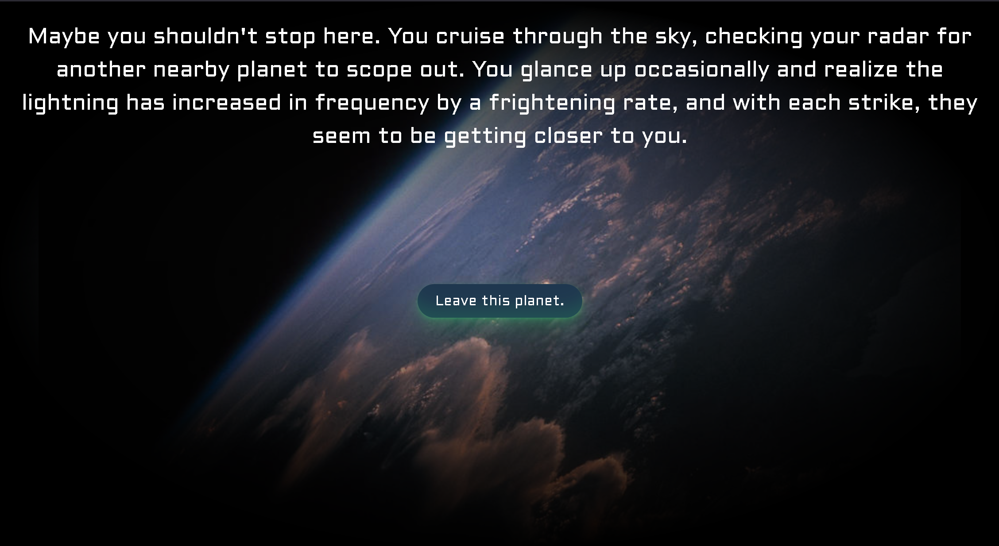

# 1. Introduction

Nebulous Enigma is a "choose your own adventure" game that allows players to experience an exciting sci-fi story the way they want, providing an entertaining and easy-to-play adventure. 

Nebulous Enigma is currently in early development. At the moment, it offers a short story demo with choices for the player to make and two endings to reach. Additionally, it allows for players to create accounts, log in securely, and play as a guest, no account required. 

GitHub: https://github.com/clw549/Nebulous-Enigma

# 2. Implemented requirements

### Requirement: As a player, I want to read a story, so that I am entertained.

Issue: [#33](https://github.com/clw549/Nebulous-Enigma/issues/33)

Pull request: [#60](https://github.com/clw549/Nebulous-Enigma/pull/60)

Implemented by: Levi Ly

Approved by: Collin Boyer

Print screen: 

### Requirement: As a player, I want to play without logging in, so that I don't have to make an account.

Issue: [#47](https://github.com/clw549/Nebulous-Enigma/issues/47)

Pull request: [#60](https://github.com/clw549/Nebulous-Enigma/pull/60)

Implemented by: Levi Ly

Approved by: Collin Boyer

Print screen: 

### Requirement: As a science fiction fan, I want a story and visuals that support the fantasy of science fiction, so that I can be immersed.

Issue: [#39](https://github.com/clw549/Nebulous-Enigma/issues/39)

Pull request: [#77](https://github.com/clw549/Nebulous-Enigma/pull/77)

Implemented by: Kayden Vicenti

Approved by: Ciaran Wham

Print screen: 

# 3. Tests
We have made some automatic tests to test Nebulous Enigma to esure the login and forms work on the front-end to the backend. To do this we used JavaScript Supertest to make unit tests. The tests make sure the site is fetching and retreaving successfully and that the authentication token is properly passed back to the front end. This ensures our system is in working order.

# 4. Adopted technologies
We have adopted React and MongoDB to create Nebulous Enigma. Using react we can make the site modular with components that can be reused. This reduces redundancy and helps keep our site consistant. MongoDB helps keep track of players logins and saves. Using MongoDB our backend is easily maintained and keeps our players data secure.

# 5. Learning/training

In order to work together effectively as a team, we have employed a few simple strategies to learn together. First, we use Udemy to learn elements that are helpful to developing with React. Using Udemy to learn React allows everybody to work with together more effectively by learning technologies that help make web design more effective. React is a strong web development library that can make websites easier to develop and structure using reusable HTML elements combined with JavaScript code.

Additionally, we have helped each other with finding tutorials for anything someone does not know how to do, as it is often harder to learn something with no background in the subject since it can be difficult to know where to start. Having another team member find a relevant resource when they are more knowledgeable on the subject has been a strategy we have consistently used. Not only is it helpful to the person who wants to learn, but it is less of a burden to the more knowledgeable team member to only provide a learning resource rather than teach the other themself.

# 6. Deployment

Link to Website: [Nebulous Enigma](https://nebulousenigma.com)

We are hosting our website on a Raspberry Pi 5.  We are using NodeJS with Nodemon and React with Vite.  We use a CloudFlare tunnel to route traffic from our domain (nebulousenigma.com) to our Vite server running at the Raspberry Pi's localhost.  The tunnel also routes requests from the Vite server sent to api.nebulousengima.com to the Node server running on the Pi's localhost.  We chose this method of hosting the site because it is lightweight and is less of a hassel then a AWS container.

# 7. Licensing

Our project is based on collaboration and allows for the use of open software. Because of this, we chose to utilize the MIT Open Source Licensing. 
Click [here](https://github.com/clw549/Nebulous-Enigma/blob/7117f94cacca9c5091fc314250d04e9d6af98472/LICENSE.md) to view the license. 

# 8. README File

[README.md](https://github.com/clw549/Nebulous-Enigma/blob/main/README.md)

[CONTRIBUTING.md](https://github.com/clw549/Nebulous-Enigma/blob/main/CONTRIBUTING.md)

[LICENSE.md](https://github.com/clw549/Nebulous-Enigma/blob/main/LICENSE.md)

[CODE_OF_CONDUCT.md](https://github.com/clw549/Nebulous-Enigma/blob/main/CODE_OF_CONDUCT.md)

# 9. Look & feel

We used SCSS and images to make Nebulous Enigma more immersive. By using images and layering other affects over it, we have made Nebulous Enigma more immersive and stylized to a sci-fi feel. This can help our players feel more part of the story, and help the player see what they are doing in this world. 

# 10. Lessons learned

Through working on Nebulous Enigma, we have learned that working as a team both provides ease and its own challenges. While many hands make easy work, desicsions can be a little harder as getting the whole group to the same page can be challenging. Getting to being on the same page may be hard, but once that is done, it is easy from there. Understanding what we are doing indevidually has made working together as a whole much easier. If everyone working on the same thing we would confuse eachother, but when we split the work it gets done hastily. Additionally getting work done early so that others have time to understand and work on aswell has been a large help. Overall, getting to the same page and getting things done early are the largest lessons Nebulous Enigma has taught us.

# 11. Demo
