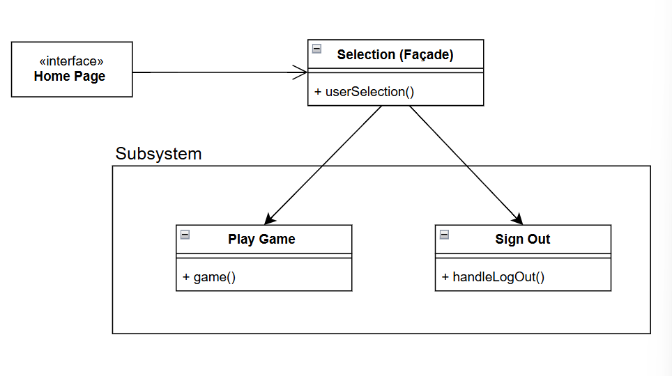
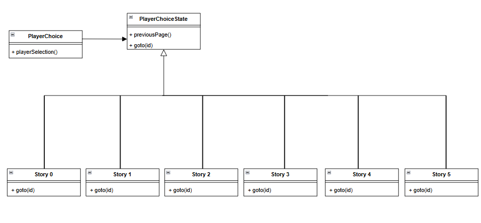

# 1. Description
Our system is a web-based video game. The game is comprised of many pages that contain text to explain the story to the user, and buttons to allow the user to make choices to affect the story. These pages will also have buttons to return to a log in page in the future. When the user first logs into the website, they are presented with the log in page. This page has multiple text entry boxes, which allow the user to input a username and a password. There are then 3 buttons, one log in button, one sign up button, and a "play as guest" button. All of the accounts, which contain a username or password, that have been made in the past are stored in a Mongodb database. This website uses the MERN stack, which allows us, the developers, to use mongodb to hangle storing all of the user data, and javascript for most of the logic. 

Once a user presses "play as guest", or inputs valid log in credentials and presses log in, they are presented with the first page of the game, which as stated previously has text to explain story, and buttons to make choices. To make an account, the user can press the "sign up" button, which presents them with a page to input the above mentioned account information, and save that information to the database. If the user is logged into an account while playing the game, the game will save the user's progress through the game. This information is saved as which page they are currently on, and is saved in the database. If a user logs in with this save data, the game will start at the page that is saved. 

# 2. Architecture

# 3. Class diagram

# 4. Sequence diagram

# 5. Design patterns
Home Page - Façade Pattern (Structural Design Pattern): https://github.com/clw549/Nebulous-Enigma/blob/main/client/src/components/home/Home.jsx

Path Selection - State Pattern (Behavioral Design Pattern): https://github.com/clw549/Nebulous-Enigma/blob/main/client/src/story.jsx

# 6. Design Principles
Design principles allow for code to have certain qualities. We use two principles well, SRP and ISP. SRP, single responisbility principle, is where each function or object has a single use or purpose. To abide by this principle, our login, signup, game, prompts, and story are all seperate allowing for more modularity in our code. Each file and function in our code have singular purpose. ISP, Interface seperation principle, works off of SRP very well. ISP is the principle for interfaces and libraries to only be used where they need to be. Since our code is already incredibly modular, we have our libraries specific to each file allowing for seperation of interfaces and libraries. We use these principles for our code to be easier to read, write, and test since excessive libraries or uses of code can make tests, and thus makes code implementation and user experience worse. Using these principles will help in our project implementation and for the user.

